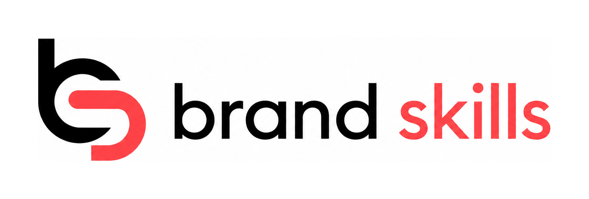

<p align="center">
  
</p>

# Brand Skills — Branding, Naming & Brand Identity for AI Agents

**Turn an idea into a real brand — name, identity, voice, and a brand book — without leaving your AI
agent.** 15 open-source [Agent Skills](https://agentskills.io) for founders, indie hackers, and
agencies building AI-native — in Claude Code, Cursor, Windsurf, and 70+ agents.

```bash
npx skills add cofoundy/brand-skills
```

[](./LICENSE)
[](#skills)
[](https://github.com/cofoundy/brand-skills/stargazers)
[](https://github.com/cofoundy/brand-skills)
<!-- Re-add once skills.sh indexes the repo (post-install telemetry):
[](https://skills.sh/cofoundy/brand-skills) -->


---

## What you get

Describe your product in a sentence. Your agent runs the skills and hands back a complete, coherent brand:

- **A name that isn't AI slop** — metaphor-driven, prior-art + domain checked, not a thesaurus mashup.
- **A full identity** — positioning, architecture, visual brief, voice, and messaging that all tell the *same* story.
- **A brand book** — guidelines ready to hand to a designer or a teammate.
- **Saved, not lost** — every brand is a reusable `brand.yaml` package, not a chat you'll never find again.

One command, minutes — instead of a blank page, a freelancer brief, and three weeks.

## Why it's different

Most "AI branding" hands you a logo with a tagline glued on. **A logo isn't a brand.** Brand Skills
finds the *story* first, then carries it through every decision — so naming, voice, and messaging
line up instead of fighting each other.

Built and dogfooded by [Cofoundy](https://cofoundy.dev) on our own products. MIT-licensed — the whole
pipeline is yours to read, fork, and ship.

## Install

### A — `npx skills` (recommended; works in 70+ agents)

Cross-agent install via the [open Agent Skills CLI](https://github.com/vercel-labs/skills) — Claude
Code, Cursor, Codex, OpenCode, and more:

```bash
npx skills add cofoundy/brand-skills           # all skills
npx skills add cofoundy/brand-skills -s naming # one skill
npx skills add cofoundy/brand-skills -g        # install globally (user dir) instead of per-project
```

Installs to your agent's skills dir (e.g. `.claude/skills/…`, `.cursor/…`). Try one without
installing: `npx skills use cofoundy/brand-skills -s naming | claude`.

### B — Claude Code plugin

```bash
/plugin marketplace add cofoundy/brand-skills
/plugin install brand-skills@brand-skills
```

### C — Local (before/without a remote)

```bash
npx skills add ./path/to/brand-skills          # or:
/plugin marketplace add /abs/path/to/brand-skills
```

**Troubleshooting:** if skills don't trigger after install, reload your agent (Claude Code:
`/reload-plugins` or restart). Each skill is self-contained markdown — `cat .claude/skills/naming/SKILL.md`
to confirm it landed.

## The brand-genesis pipeline

```
        ┌─────────────┐
        │brand-context│  ← foundation. Every skill reads this first.
        └──────┬──────┘
               │
   naming ─→ brand-architecture ─→ brand-identity ─┐
   (metaphor   (standalone vs       (logo brief,    │
    engine)     sub-brand vs         palette, type) │
                house-of-brands)                    ▼
   brand-strategy · brand-positioning · target-audience · competitor-branding
                                                    │
   brand-voice · brand-messaging · brand-story ─────┤
                                                    ▼
                                          brand-guidelines  (the brand book)
                                          brand-audit · rebranding
```

## Skills

| Skill | What it does |
|-------|--------------|
| **brand-init** | Scaffolds a structured brand **package** (`brand.yaml` + folder) and registers it in a portfolio. The persistence layer every other skill reads/writes. |
| **naming** | Metaphor-driven brand & product naming. 30–50 candidates → filtered → prior-art + availability checked → vetted finalists. Avoids AI slop. |
| **brand-context** | Foundation. Captures the brand DNA every other skill reads first. |
| **brand-strategy** | Brand heart, archetype, values — the full strategy report. |
| **brand-architecture** | Standalone vs sub-brand vs branded-house vs house-of-brands. Naming systems for product families. |
| **brand-positioning** | Competitive map, positioning territory + statement, proof points. |
| **target-audience** | ICP, personas, psychographics, audience language. |
| **competitor-branding** | How competitors brand themselves → gaps + differentiation. |
| **brand-identity** | Visual identity brief — logo direction, color, type, imagery (to brief a designer). |
| **brand-voice** | Verbal identity — tone, voice qualities, vocabulary, writing rules. |
| **brand-messaging** | Messaging hierarchy — taglines, value prop, key messages. |
| **brand-story** | Origin story + founder narrative (long / short / one-liner). |
| **brand-guidelines** | The brand book — logo usage, color, type, voice, application rules. |
| **brand-audit** | Brand health across 6 dimensions. |
| **rebranding** | Audit → reposition → relaunch an existing brand. |

> **Scope:** v0 is brand *genesis* — creating a brand. It does not do go-to-market (ads, channels,
> growth). That's intentional; a brand should exist before it's marketed.

## Brand packages & registry (the persistence layer)

Unlike chat-only brand tools, Brand Skills writes a **brand package** — a versioned, queryable folder:

```
brand/
  brand.yaml          # manifest: name, one-liner, status, archetype, which artifacts exist
  context.md  naming.md  strategy.md  identity.md  voice.md  guidelines.md  …
  assets/
```

Managing several brands? A `brands/registry.yaml` indexes them so any agent can answer "what brands
do we have / where / what's the one-liner" in one query. The registry is a **SSOT file, not agent
memory** — git-tracked and shareable. Full spec: [`references/brand-package-spec.md`](./references/brand-package-spec.md).

## Spanish / LATAM localization

First-class **Spanish / LATAM** support — Spanish phonosemantics, cultural-connotation screening
across major markets, and regional conventions — alongside English. See
[`references/localization-es-latam.md`](./references/localization-es-latam.md).

## Credits

Built on two excellent MIT-licensed projects, absorbed and extended here (see [`NOTICE`](./NOTICE)):

- Naming engine adapted from [**glacierphonk/naming**](https://github.com/glacierphonk/naming).
- Brand-genesis skills adapted from [**arnabbagxd/Brand-building-skills**](https://github.com/arnabbagxd/Brand-building-skills).

## License

[MIT](./LICENSE) © Cofoundy SAC. Upstream copyrights preserved in [`NOTICE`](./NOTICE).

---

<sub>Keywords: brand skills · branding · brand strategy · brand naming · brand identity · brand
voice · brand positioning · brand guidelines · rebranding · agent skills · Claude Code · AI
branding · brand book generator.</sub>
