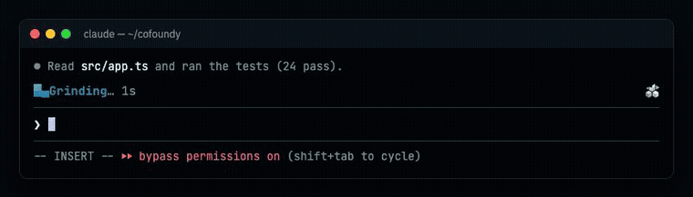

# Brand Mod

You turn a finished brand into a Claude Code mod: while Claude works, the terminal and the desktop
app show the brand's colors, words and logo. You never ship it blind. You **show it in HTML, get
approval, then generate**.

## Before You Start

**Load the brand package first.** Look for `brand.yaml` (in `./`, `./brand/`, or `brands/<slug>/`);
read it, `identity.md` (palette) and `voice.md` (vocabulary) from the same folder. No package yet?
Run `brand-init`, then `brand-identity` and `brand-voice`. You need at least a primary color and an
SVG logo.

**Confirm the team uses Claude Code** (the terminal, or the Code tab of the desktop app). Mods are
Claude Code plugins; they don't run in Cursor, claude.ai chat, or other agents. Ask; don't assume.

## Steps

1. **Write `mod.json`** in the brand package (schema in the docstring of `scripts/brand-mod.py`):
   - `primary` from `identity.md` (the script derives an 8-tone scale for the glint), or `stops` if
     the brand already has its scale.
   - `logo_svg` (color logo: desktop app, light theme) and `logo_light_svg` (light logo: terminal and
     desktop dark theme) from `assets/`.
   - `words` per turn phase and `done` for the end of turn — see **Words** below.
   - `name`, `slug` and the domain come from `brand.yaml`; don't repeat them.
2. **Generate:** `python3 scripts/brand-mod.py <package>/mod.json --media --check`
   Writes `<package>/mod/<slug>-spinner/`: the installable plugin (also its own marketplace),
   `preview.html`, a `README.md` with the GIFs first, and `media/`. `--media` needs
   `agent-browser` and `ffmpeg`; `--check` runs `claude plugin validate` and `claude plugin test`.
   Both are optional; without `rsvg-convert` the terminal gets no logo.
3. **Show it:** open or share `preview.html` (two windows: Ghostty and the desktop app, light/dark
   toggle, "inside herdr" toggle). If your host can publish HTML pages (e.g. Claude Artifacts),
   publish it and hand over the link.
4. **Approval gate:** the owner approves the preview or asks for changes. Changes go into `mod.json`
   and you regenerate. Never edit `hooks/brand.ts` by hand, and never install or ship before approval.
5. **Ship:** the generated folder goes into a repo. Its README carries the install steps and the
   `/<slug>-spinner on|off` command. Set `artifacts.mod: true` in `brand.yaml`.

## Words

- Gerunds the team actually says, in their language: 3–6 per phase (`thinking`, `tool-use`,
  `tool-input`, `responding`, `requesting`). Pull them from `voice.md` (vocabulary, tone), not from
  puns on the brand name.
- Cut anything nobody says. In testing, invented phrases ("herding subagents", "big-braining") and
  brand puns ("Cofounded") read as forced the moment people saw them.
- The end of turn reads «<word> for 12s» (the engine adds "for"): past participles work ("Shipped",
  "Cooked").
- Have someone on the team read the list before shipping.

## What the mod does

- **Terminal:** a 2×2 square of three cubes with a turning gap, then the phase word; one glint in the
  brand scale crosses the square and the word. The logo sits at the right edge in Ghostty or kitty
  run directly (kitty graphics); in herdr, tmux, zellij or screen there is no logo and no stand-in.
- **Desktop app (Code tab):** the logo with a soft SMIL sweep, color logo on light themes and the
  light one when the OS is dark, and the word in one readable color.
- **End of turn:** the brand's `done` words instead of "Baked".
- `/<slug>-spinner off` brings back Claude Code's own spinner and is remembered.

Design decisions and the failures behind them: [`method.md`](./method.md). Worked example:
[`examples/cofoundy/`](./examples/cofoundy/) (package, `mod.json`, generated mod with its README).

## Related skills

- **brand-identity** — the palette and logo direction this skill reads.
- **brand-voice** — the vocabulary the spinner words come from.
- **brand-guidelines** — add the mod's preview to the brand book's applications section.
