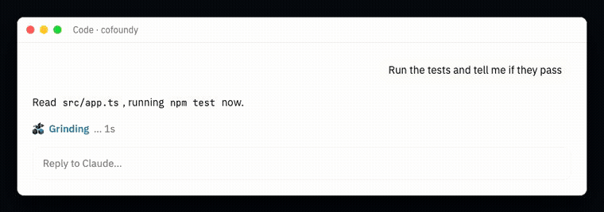
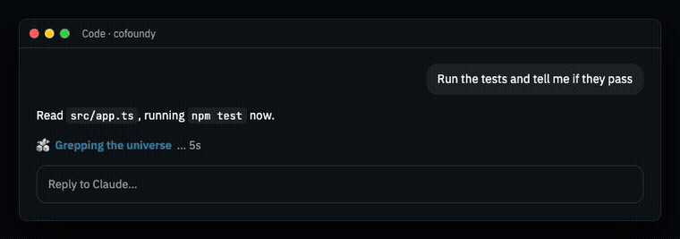

<p align="center"></p>

<p align="center">
  
  
</p>

<h1 align="center">Cofoundy spinner for Claude Code</h1>

<p align="center">While Claude works, your terminal and the desktop app wear your brand.</p>

---

## What you see

**In the terminal.** A 2×2 square of three cubes and a turning gap. One glint in Cofoundy's colors crosses the square and carries on through the word for what Claude is doing: «Mulling», «Connecting dots», «Cooking ideas», «Grinding», «Grepping the universe», «Orchestrating agents», «Hotfixing», «Spinning up subagents». In Ghostty or kitty run directly, your logo sits at the right edge of that row.

**In the desktop app** (Code tab). Your logo with a soft sweep every few seconds, and the word in the brand color, readable on light and dark themes.

**At the end of each turn.** Instead of «Baked for 12s», a word of yours: «Shipped», «Cooked», «Tokenmaxxed», «Vibecoded», «Deployed».

## Install

This folder is its own marketplace. Push it to a repo, then in Claude Code:

```
/plugin marketplace add <owner>/<repo>
/plugin install cofoundy-spinner@cofoundy
```

Try it without installing, from the folder that contains it:

```
claude --plugin-dir ./cofoundy-spinner
```

Open `preview.html` in a browser to see it moving before you install.

## Use it

| Command | What it does |
|---|---|
| `/cofoundy-spinner off` | Back to Claude Code's own spinner. Remembered across sessions. |
| `/cofoundy-spinner on` | Turns it back on. |

Inside herdr, tmux or zellij the terminal logo doesn't show (they don't pass images through); the square and the word do.

## Change colors, words or logo

Everything comes from `mod.json` in your brand package. Edit it and regenerate with the
[`brand-mod`](https://github.com/cofoundy/brand-skills/tree/main/skills/brand-mod) skill:

```
python3 brand-mod.py path/to/mod.json --media --check
```

`hooks/brand.ts` is generated from it; don't edit it by hand.

## Requirements

Claude Code with mods (function hooks). The mods API is early access: if a Claude Code update
changes it, the spinner falls back to Claude Code's own and nothing else breaks.

---

<p align="center"><sub>Made with <a href="https://github.com/cofoundy/brand-skills">Brand Skills</a> by <a href="https://cofoundy.dev">Cofoundy</a>.</sub></p>
